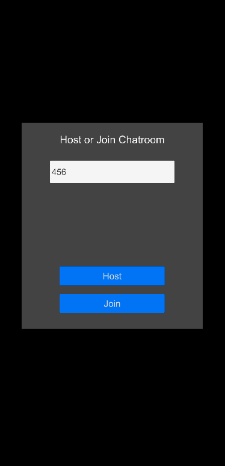
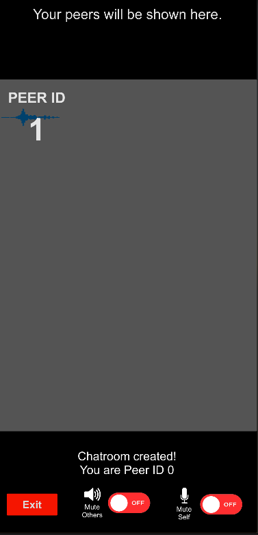

### ⚠️ This repository has been archived as samples have been moved to the [main UniVoice repository](https://github.com/adrenak/univoice)

# UniVoice Sample

This repo contains a simple group voice chat application using UniVoice. To [learn more about UniVoice](https://www.github.com/adrenak/univoice)  

UniVoice requires three key components:
- An audio input implementation
- An audio output implementation
- A network implementation

This project uses the "official" implementations:
- [UniVoiceUniMicInput](https://www.github.com/adrenak/univoice-unimic-input) that captures input using the microphone
- [UniVoiceAudioSourceOutput](https://www.github.com/adrenak/univoice-audiosource-output) that plays audio inside Unity using AudioSource
- [UniVoiceAirPeerNetwork](https://www.github.com/adrenak/univoice-airpeer-network) that uses [AirPeer](https://www.github.com/adrenak/airpeer) to send and receive audio data

Demo APK:
Demo APKs under github releases.

